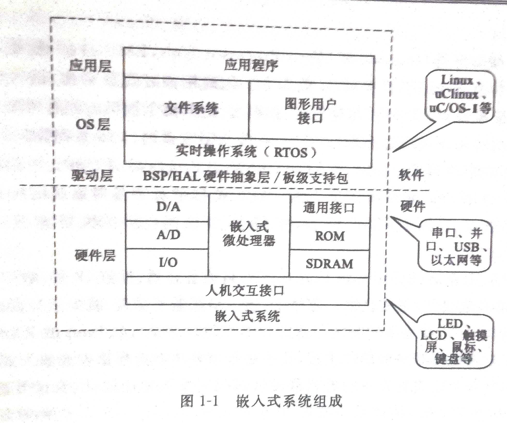
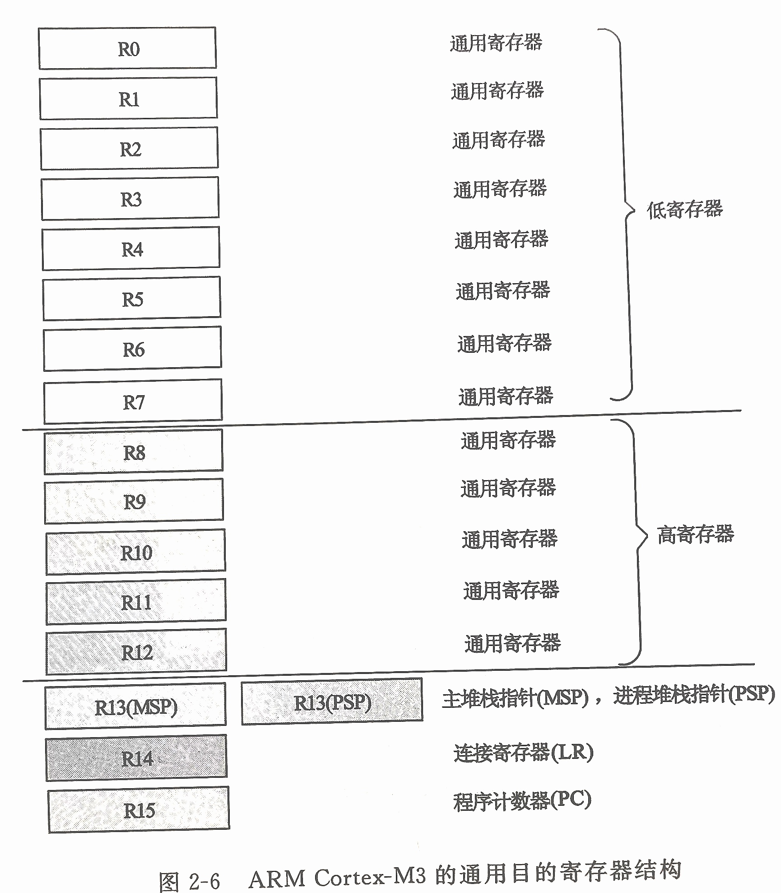
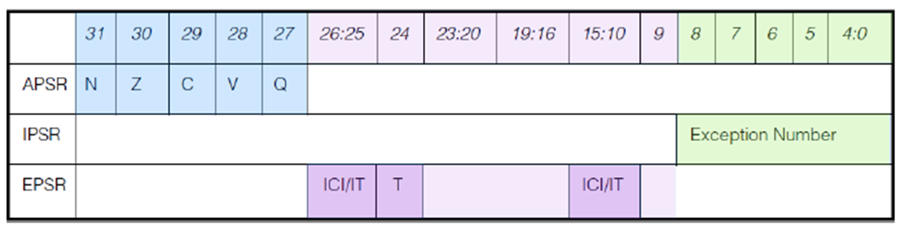
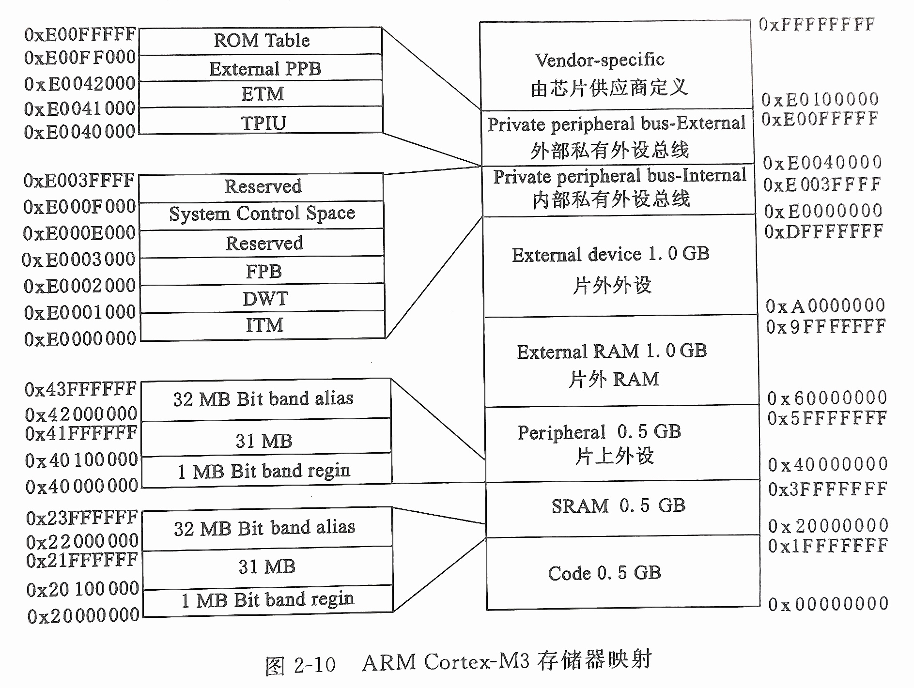
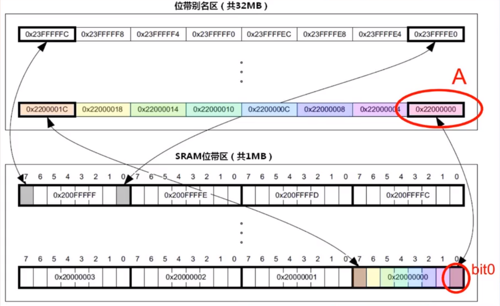
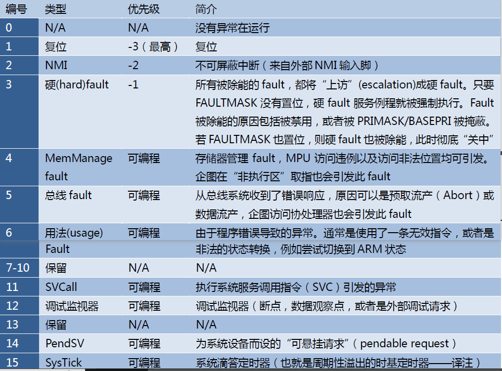
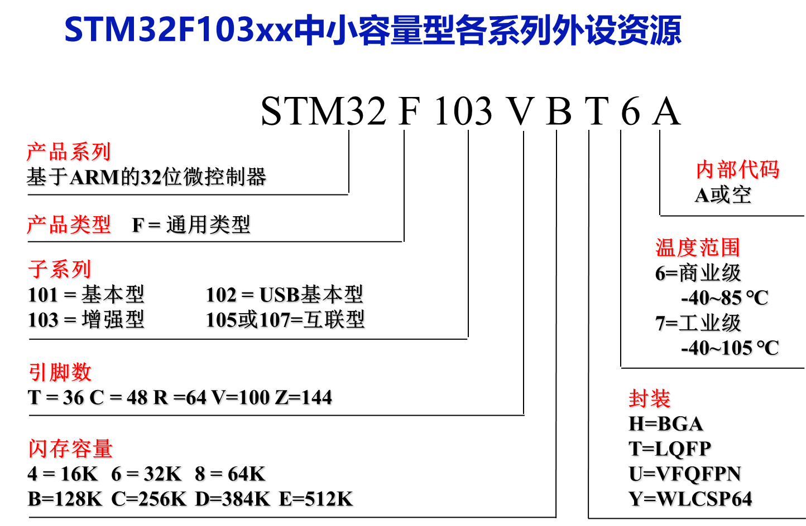
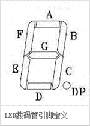
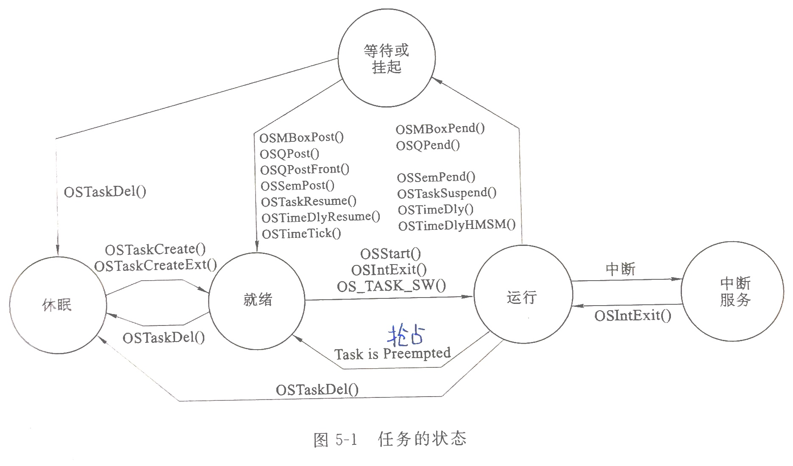

# 前言

1. ★：重点
2. ※：补充内容
3. 内容主要来源：教材、PPT、百度百科、AI
4. 重点来源：4-6班
5. 感谢：lyf
6. 总结得很草率，因为没听过课，也玩不懂

# 重点汇总

1. 考试题型
   1. 选择（40 分）
   2. 简答（20 分）
   3. 程序题（20 分）
      1. 内容包括代码说明、实现部分功能等
      2. 考查方式如代码填空、写注释、回答执行效果
   4. 问答题（20 分）
2. 主要知识点
  1. 第 1 章：
    1. 嵌入式系统概念、应用与特点
    2. 嵌入式系统的硬件（CPU、外设）
    3. 主要嵌入式软件系统（应用及 OS）
    4. 嵌入式系统的发展趋势
  2. 第 2 章：
    1. ARM 处理器特点及应用
    2. CM3 微控制器简介
    3. CM3 存储格式类型
    4. CM3 嵌套向量中断控制器 NVIC
    5. CM3 寄存器组织
    6. CM3 存储映射（位带及计算）
    7. CM3 异常与中断
    8. STM32 时钟源与时钟树
    9. STM32F10 系列的 GPIO
  3. 第 3 章：
    1. 嵌入式开发环境(交叉编译、开发、调试工具)
  4. 第 4 章：
     1. GPIO 实验（流水灯程序，八段数码管显示程序）
     2. 按键原理、中断过程与中断程序设计（键盘扫描程序）
     3. 串口通信原理与程序设计（接收数据处理）
     4. 模数转换原理与程序设计
     5. 定时器与看门狗原理与程序设计
  5. 第 5 章：
    1. 嵌入式操作系统概念、特点及应用
    2. 任务状态机
3. 复习要点
  1. 阅读教材，突出重点
  2. 分析代码，尤其初始化部分，动作部分，理解程序。
  3. 了解嵌入式处理器的选型原则（根据需求，性能，成本，开发工具，已有资源）
  4. 了解嵌入式系统的发展趋势
  5. 了解嵌入式系统发展的挑战与机遇

# 第 1 章

## 嵌入式系统

### 概念

**以应用为中心**、**以计算机技术为基础**、软件硬件可裁剪、适应应用系统对功能、可靠性、成本、体积、功耗严格要求的**专用计算机系统**。

### 应用

1. 国防军事
2. 工业控制
3. 交通管理
4. 信息家电
5. 办公自动化
6. POS网络及电子商务领域
7. 医疗保健设备
8. 环境工程与自然
9. 机器人
10. 移动终端设备

### 特点

1. 以应用为中心

2. 以计算机技术为基础

   > 计算机系统由软件和硬件构成

3. 专用于特定任务
4. 多类型处理器和处理器系统支持
5. 通常极其关注（系统）成本
6. 一般是实时系统
7. 可裁剪性好
8. 可靠性高
9. 大多有功耗约束

### 组成



#### 硬件

##### 嵌入式微处理器

1. 嵌入式微控制器（Micro Controller Unit，MCU）/ 单片机

2. 嵌入式微处理器（Embedded Micro Processor Unit，EMPU）

   各公司产品

   1. ARM
   2. MIPS
   3. PowerPC
   4. x86
   5. Motorola 68000

3. 嵌入式DSP处理器（Embedded Digital Signal Processor，EDSP）

4. 嵌入式片上系统（System on Chip，SoC）

##### 外围设备

###### 按功能分类

1. 存储设备
2. 通信设备
3. I/O设备/显示设备

###### 按技术分类

1. 静态易失型存储器
   1. RAM
   2. SRAM
2. 动态存储器（DRAM）
3. 非易失型存储器
   1. ROM
   2. EPROM
   3. EEPROM
   4. FLASH（广泛应用）

#### 软件

##### 嵌入式操作系统

1. RTOS
2. Linux
3. Android
4. Windows CE
5. μC/OS-II

##### 应用软件

1. 嵌入式支持软件
2. 应用程序

### 嵌入式系统的发展趋势

1. 嵌入式开发是一项系统工程
2. 网络化、信息化的要求
3. 网络互连、移动互联成为必然趋势
4. 精简系统内核、算法，降低功耗和软硬件成本
5. 提供友好的多媒体人机页面

# 第 2 章

## ARM 处理器

ARM微处理器采用 RISC 架构

### 特点

1. 体积小、低功耗、低成高性能
2. 支持 Thumb （16位）/ ARM 或 Thumb-2（32位）指令集，能很好地兼容 8 位 / 16 位器件
3. 大量使用寄存器，指令执行速度更快
4. 大多数数据操作都在寄存器中完成
5. 寻址方式简单灵活，执行效率高
6. 指令长度固定

### 应用

1. 工业控制
2. 无线通讯
3. 网络应用
4. 消费类电子产品
5. 成像和安全产品

## ARM-Cortex-M3 微控制器

### 简介

> Cortex-M3基础.ppt

* Cortex‐M3 微控制器是一款基于 ARMv7-M 架构的 32 位 RISC（精简指令集计算）处理器内核。内部的数据是32 位的，寄存器是32 位的，存储器接口也是32 位的。
* CM3 采用了哈佛结构，拥有独立的指令总线和数据总线，可以让取指与数据访问并行。这样一来数据访问不再占用指令总线，从而提升了性能。

#### 工作模式

1. 线程模式
2. 处理模式

#### 工作状态

1. Thumb 状态

   16位和32位的指令运行状态

2. 调试状态

   处理器停止并进入调试

### 存储格式类型

> GPT-4

1. 字节 (8 位)：Cortex-M3 支持 8 位字节存储格式，用于存储较小的数据，如字符。

2. 半字 (16 位)：Cortex-M3 支持 16 位半字存储格式，用于存储较大的数据，如短整数。

3. 字 (32 位)：Cortex-M3 支持 32 位字存储格式，用于存储更大的数据，如整数和浮点数。

> Cortex-M3 对半字和字的访问要求进行对齐。对于半字访问，地址必须是 2 的整数倍；对于字访问，地址必须是 4 的整数倍。不对齐的访问可能导致硬件异常。

### 嵌套向量中断控制器 NVIC

嵌套向量中断控制器（ NVIC ）是 ARM Cortex -M3处理器中一个完整的部分。 ARM Cortex -M3的所有中断机制都由 NVIC 实现。 NVIC 可以被高度配置，为处理器提供出色的中断处理能力。在 NVIC 的标准执行中，它提供了一个非屏蔽中断（ NMI ）和32个通用物理中断，这些中断带有8级的抢占优先权。 NVIC 可以通过综合选择配置为1到240个物理中断中的任何一个，并带有多达256个优先级。

### ARM指令系统※

#### 数据传送指令

1. 在两个寄存器间传递数据

   MOV   R8, R3

2. 在寄存器与存储器间传递数据

   1. LDRB  Rd, [Rn, #offset]
   2. STRB  Rd, [Rn, #offset]

3. 在寄存器与特殊功能寄存器间传递数据

   1. MRS <gp_reg>, <special_reg> 

      功能：读特殊功能寄存器的值到通用寄存器。

   2. MSR <special_reg>, <gp_reg> 

      功能：写通用寄存器的值到特殊功能寄存器。

4. 把一个立即数加载到寄存器

   1. MOV  R0， #0x12 ; 支持最多8位立即数加载
   2. 32位指令MOVW和MOVT可以支持16位立即数加载

#### 算术运算指令

| 示例                                                         | 功能描述         |
| ------------------------------------------------------------ | ---------------- |
| ADD  Rd, Rn, Rm  ; Rd =   Rn+Rm  ADD  Rd,  Rm     ;  Rd += Rm   ADD  Rd,  #imm   ;  Rd += imm | 常规加法 imm     |
| ADC  Rd, Rn,  Rm   ; Rd = Rn+Rm+C   ADC  Rd,  Rm    ; Rd += Rm+C   ADC  Rd,  #imm    ; Rd += imm+C | 带进位的加法 imm |
| ADDW  Rd, #imm12    ; Rd += imm12                            | 带               |
| SUB  Rd,  Rn     ;  Rd -= Rn  SUB  Rd, Rn,   #imm3  ; Rd = Rn-imm3   SUB  Rd,  #imm8   ;  Rd -= imm8   SUB  Rd, Rn,  Rm   ; Rd = Rm-Rm | 常规减法         |
| SBC    Rd, Rm   ; Rd -= Rm+C   SBC.W  Rd, Rn, #imm12 ; Rd=   Rn-imm12-C   SBC.W  Rd, Rn,  Rm  ; Rd = Rn-Rm-C | 带借位的减法     |
| RSB.W  Rd, Rn, #imm12 ; Rd = imm12-Rn   RSB.W Rd, Rn,  Rm  ; Rd =   Rm-Rn | 反向减法         |
| MUL  Rd,  Rm    ; Rd *= Rm   MUL.W  Rd, Rn, Rm  ;  Rd = Rn*R | 常规乘法         |
| MLA  Rd, Rm,  Rn, Ra ; Rd = Ra+Rm*Rn   MLS  Rd, Rm,  Rn, Ra ; Rd = Ra-Rm*R | 乘加与乘减       |
| UDIV Rd, Rn, Rm  ; Rd =   Rn/Rm   SDIV Rd, Rn, Rm  ; Rd =   Rn/Rm | 硬件支持的除法   |

#### 逻辑操作指令

| 示例                                                         | 功能描述                     |
| ------------------------------------------------------------ | ---------------------------- |
| AND   Rd,  Rn      ; Rd &= Rn   AND.W Rd, Rn, #imm12 ; Rd = Rn & imm12   AND.W Rd, Rm, Rn    ; Rd = Rm & Rn | 按位与                       |
| ORR  Rd, Rn       ; Rd \|= Rn   ORR.W Rd, Rn, #imm12  ; Rd =   Rn \| imm12   ORR.W Rd, Rm, Rn      ; Rd =   Rm \| Rn | 按位或                       |
| BIC  Rd, Rn        ; Rd &= ~Rn   BIC.W Rd, Rn, #imm12   ; Rd = Rn & ~imm12   BIC.W Rd, Rm, Rn      ; Rd = Rm & ~Rn | 位段清零                     |
| ORN.W Rd, Rn, #imm12  ; Rd =   Rn \| ~imm12   ORN.W Rd, Rm, Rn    ;  Rd = Rm \| ~Rn | 按位或反码                   |
| EOR   Rd,  Rn      ; Rd ^= Rn   EOR.W Rd, Rn, #imm12  ; Rd =   Rn ^ imm12   EOR.W Rd, Rm, Rn      ; Rd =   Rm ^ Rn | （按位）异或，异或总是按位的 |

#### 子程调用与无条件跳转指令

1. 最基本的无条件跳转指令

   1. B   Lable；跳转到Lable处对应的地址

   2. BX  reg；跳转到由寄存器reg给出的地址

      在BX中，reg的最低位指示出在转移后将进入的状态，必须保证reg的LSB=1

2. 调用子程序时，使用的指令的助记符为BL。如：

   1. BL Lable;   跳转到Lable对应的地址，并且将跳转前的下条指令地址保存到LR

   2. BLX reg; 跳转到由寄存器reg给出的地址，并根据reg的LSB切换处理器状态，还要将跳转前的下条指令地址保存到LR

      BLX还带有改变状态的功能。因此，reg的LSB必须是1，以确保不会试图进入ARM状态，否则会出现Fault。

3. BX LR  ;从子程序返回

### 寄存器组织

#### 通用寄存器



1. 低寄存器。寄存器R0\~R7可以被指定通用寄存器的所有指令访问，复位后的初始值是不可预知的。
2. 高寄存器。寄存器R8\~R12可以被指定通用寄存器的所有32位指令访问，但不能被16位指令访问，复位后的初始值是不可预知的。
3. 堆栈指针。寄存器R13用做堆栈指针（ SP )。由于 SP 忽略了写入位［1:0］的值，因此它自动与字（即4字节边界）对齐。堆栈指针对应两个物理寄存器 SP_main 和 SP_process ，处理模式始终使用 SP_main ，而线程模式可配置为 SP_main 或 SP_process 。尽管有两个 SP ，但在某个时刻只能看到其中的一个，这也就是所谓的"banked"寄存器。
4. 链接寄存器。寄存器R14是子程序的链接寄存器（ LR )。在执行分支（ branch ）和链接（ BL ）指令或带有交换的分支和链接指令（ BLX ）时， LR 用于接收来自 PC 的返回地址。 LR 也用于异常返回，其他任何时候都可以将R14看做一个通用寄存器。
5. 程序计数器。寄存器R15为程序计数器 PC ，指向当前的程序地址。该寄存器的位0始终为0，因此，指令始终与字或半字边界对齐。如果修改它的值，就能达到改变程序执行流程的目的。

#### 特殊功能寄存器

1. 程序状态字寄存器组PSRs

   

   1. 应用程序 PSR（APSR）
   2. 中断号 PSR（IPSR）
   3. 执行 PSR（EPSR）

   这3 个寄存器既可以单独访问，也可以组合访问（2 个组合，3 个组合都可以），当使用三合一的方式访问时，应使用名字“xPSR”或者“PSRs”。

   

2. 中断屏蔽寄存器组PRIMASK, FAULTMASK, BASEPRI

3. 控制寄存器CONTROL

### 存储映射

#### 基本特征

> Cortex-M3基础.ppt

* Cortex-M3的存储系统采用统一编址方式，小端模式。
* 4GB 的线性地址空间内，寻址空间被分成 8 个主块：block0-block7 ，每块512MB
* 片内Flash：从 0x00000000开始
* 片内SRAM：从 0x20000000开始
* 包括
  * 代码空间
  * 数据空间
  * 位段、位段别名
  * 寄存器
  * 片上外设
  * 外部存储器
  * 外部外设

#### 存储区映射



#### [位带操作及计算](https://www.bilibili.com/video/BV1Mg411Q78s?t=581.0)

* 定义：位带别名技术是一种常用的操作内存的方法，可以将一个位的访问转化为对内存的访问，以便更方便地对单个位进行操作。在STM32中，位带别名技术可以通过位带映射区域来实现。

* 公式：位带别名地址 = 位带映射区域起始地址 + (原始地址 - 0x20000000) × 32 + 位在字节中的偏移量 × 4

  其中，位带映射区域起始地址为0x22000000，原始地址每个位所占的地址空间为32位，位在字节中的偏移量指的是位在8位字节中的偏移量，范围为0到7。

* 举例：第2位的别名地址应该是0x22000000 + 2x4 = 0x22000008。

* 例题：[选择题 40 题](嵌入式选择题-from hqh.md#题目列表)



### 异常与中断

#### 定义

ARM Cortex-M3的所有中断机制都由[NVIC](###嵌套向量中断控制器 NVIC)实现。NVIC除了支持240 个外部中断之外，还支持11个内部异常源。ARM Cortex-M3 处理器和嵌套向量中断控制器(NVIC)对所有异常按优先级进行排序并处理。

#### 异常类型

* 编号是指异常入口相对于向量起始表处以字为单位的偏移量

* 数字越小，优先级越高

* 0\~15号异常中有5个是保留的。1\~15号为系统异常的编号，没有编号为0的异常，一般该地址设置MSP的初始值。

  > 主堆栈指针（Main Stack Pointer，MSP）

  

* 从16开始的所有编号为外部中断对应的异常的编号。

  

## STM32处理器

STM32F103VBT6 是 STM32F103xxx 系列 ARM Cortex-M3 处理器中的一种



### 时钟源与时钟树

#### 时钟源简表

| 简称 | 名称         | 频率                    | 作用                                    | 来源                                | 相关的重要寄存器（位）                    | 特点                                                         |
| ---- | ------------ | ----------------------- | --------------------------------------- | ----------------------------------- | ----------------------------------------- | ------------------------------------------------------------ |
| HSE  | 高速外部时钟 | 4~16MHz                 | 驱动系统时钟                            | 外部晶体/陶瓷振荡器，或用户外部时钟 | RCC_CR中的HSEON、HSERDY、HSEBYP位。       | 时钟频率精度高                                               |
| LSE  | 低速外部时钟 | 32.768kHz               | 驱动RTC                                 | 外部晶体或陶瓷谐振器，或外部时钟    | RCC_BDCR中的LSEON、LSERDY、LSEBYP位       | 为实时时钟或者其他定时功能提供低功耗且精确的时钟源           |
| HSI  | 高速内部时钟 | 8MHz                    | 驱动系统时钟                            | 内部8MHz的RC振荡器                  | RCC_CR中的HSION、HSIRDY、HSITRIM[4:0]位。 | 启动时间比HSE晶体振荡器短，但时钟频率精度较差。可在HSE晶体振荡器失效时作为备用时钟源。 |
| LSI  | 低速内部时钟 | 约40kHz (30kHz ~ 60kHz) | 为独立看门狗、RTC和自动唤醒单元提供时钟 | 内部RC振荡器                        | RCC_CSR中的的LSION、LSIRDY                | 可以在停机和待机模式下保持运行                               |
| PLL  | 锁相环时钟   | <=72MHz                 | 驱动系统时钟                            | HIS或HSE                            |                                           |                                                              |

#### 时钟源相关寄存器

位于片上外设存储区，地址范围是0x4002\_1000-0x4002\_13FF

* 时钟控制寄存器(RCC_CR)。复位值: 0x000 XX83，X代表未定义。偏移量0x0。
* 时钟配置寄存器(RCC_CFGR)。复位值: 0x0000 0000。偏移量0x4。
* 时钟中断寄存器(RCC_CIR)。复位值: 0x0000 0000。偏移量0x8。
* 备份域控制寄存器(RCC_BDCR)。复位值：0x0000 0000。偏移量0x20。
* 控制/状态寄存器(RCC_CSR)。复位值：0x0C00 0000。偏移量0x24。

### STM32F10xxx 系列的 GPIO

* 通用输入/输出口(GPIO)是一个灵活的由软件控制的数字信号，每个GPIO都代表一个连接到CPU特定引脚的一个位。
* GPIO端口**特点**
  1. 通用I/O（GPIO)
  2. 单独的位设置或清除
  3. 所有端口都有外部中断能力
  4. 复用功能
  5. 软件重映射I/O复用功能
  6. GPIO锁定机制
* STM32的GPIO端口的每一位都可以由软件配置成多种**模式**
  * 输入浮空
  * 输入上拉
  * 输入下拉
  * 模拟输入
  * 开漏输出
  * 推挽式输出
  * 推挽式复用功能
  * 开漏复用功能

# 第 3 章

## 嵌入式开发环境

### 交叉编译

#### 定义

交叉编译（Cross-Compilation）是指在某个平台上（如PC）用交叉编译器编译出可在其他平台（如ARM）运行的代码的过程

#### 工具

在主机平台上安装对应的交叉编译工具链（cross compilation tool chain），然后用它编译程序源代码，最终生成可在目标平台上运行的代码

### ARM 交叉开发软件


### 嵌入式软件调试方法

1. 指令集模拟器
2. 驻留监控软件
3. JTAG 仿真器
4. 在线仿真器

### 嵌入式软件调试工具

1. J-LINK
2. H-JTAG 调试代理
3. Banyan Daemon
4. U_LINK 仿真器
5. J-LINK 仿真器

# 第 4 章

## GPIO 实验

### 流水灯程序

#### 代码

##### main.c

```c
/******************************流水灯************************
* 流水灯
* 现象：二极管从左至右依次全部点亮
*************************************************************/
#include "sys.h"
#include "delay.h"
#include "led.h"
u8 light;
int main( void )
{
	Stm32_Clock_Init( 6 );  //6倍频
	delay_init( 72 ); //12M外部晶振
	LED_Init();
	GPIOE->ODR &= ~(0xff<<8);
	LED_SEL = 1; //选择二极管	
	light = 0x01;
	while( 1 )
	{
		GPIOE->ODR |= (light<<8);
		delay_ms( 300 ); 
		light = light<<1;
		if( light==0x00 )
		{
			GPIOE->ODR &= ~(0xff<<8);
			delay_ms( 300 ); 
			light = 0x01;
		}					
	}
}
```

##### led.c

```c
/*********************二极管及数码管初始化或实现********************
*        湖南科技大学
******************************************************************/
#include "led.h"
/***************************数码管段选***************************/
u8 segTable[] = {0x3f,0x06,0x5b,0x4f,0x66,0x6d,0x7d,0x07,0x7f,0x6f};
u8 segTablePortation[] = {0xbf,0x86,0xdb,0xcf,0xe6,0xed,0xfd,0x87,0xff,0xef};
/****************************************************
* 初始化二极管LED灯的引脚端口
******************************************************/
void LED_Init(void)
{
	RCC->APB2ENR|=1<<0;	//使能AFIO
	RCC->APB2ENR|=1<<3;  //使能PORTB时钟
	RCC->APB2ENR|=1<<6;	//使能PORTE时钟	 
	   	 
	AFIO->MAPR |= 0x02000000; //设置PB.3为I/O口可用，且可以SW仿真
	GPIOB->CRL &= 0xFFFF0FFF;
	GPIOB->CRL |= 0x00003000; //PB.3推挽输出
	GPIOB->ODR |= 0x00000008; //PB.3输出高
												  
	GPIOE->CRH&=0X00000000;
	GPIOE->CRH|=0X33333333; //PE.8-15推挽输出
	GPIOE->ODR|=0x0000ff00; //PE.8-15输出低
	
}
/***************************************
* 流水灯选择，或数码管段选
* value:显示的数值对应的段选二进制值
****************************************/
void LedValue(u8 value)
{
		LED0 = (value&0x01)?1:0;
		LED1 = (value&0x02)?1:0;
		LED2 = (value&0x04)?1:0;
		LED3 = (value&0x08)?1:0;
		LED4 = (value&0x10)?1:0;
		LED5 = (value&0x20)?1:0;
		LED6 = (value&0x40)?1:0;
		LED7 = (value&0x80)?1:0;	
}
/***************************************
* 数码管显示不带小数点的数值
* 参数 w:显示的位置，即位选，左-右：0-7
*      value:要显示的数值
****************************************/
void SetLed(u8 w, u8 value)
{
	SEL0 = w%2;
	SEL1 = w/2%2;
	SEL2 = w/4;
	LedValue(segTable[value]);
}
/***************************************
* 数码管显示带小数点的数值
* 参数 w:显示的位置，即位选，左-右：0-7
*      value:要显示的数值
****************************************/
void PortationDisplay(u8 w, u8 value)
{
	SEL0 = w%2;
	SEL1 = w/2%2;
	SEL2 = w/4;
	LedValue( segTablePortation[value] );
}
```

### 八段数码管显示程序

#### LED数码管引脚定义



```markdown
位 0: a (顶部水平段)
位 1: b (右上角垂直段)
位 2: c (右下角垂直段)
位 3: d (底部水平段)
位 4: e (左下角垂直段)
位 5: f (左上角垂直段)
位 6: g (中间水平段)
位 7: dp (小数点)
```

#### 共阴极数码管0-F段编码

```c
 unsigned char code table[] = {	//共阴极 0—F 数码管编码
     0x3f, 0x06, 0x5b, 0x4f,	//0~3
     0x66, 0x6d, 0x7d, 0x07,	//4-7
     0x7f, 0x6f, 0x77, 0x7c, 	//8~b
     0x39, 0x5d, 0x79, 0x71 	//c~f
}
```

#### 代码

##### main.c

```c
/******************************8位数码管动态扫描************************
* 8位数码管动态扫描
* 每位数码管显示的数字从0加到9
***********************************************************************/
#include "sys.h"
#include "delay.h"
#include "led.h"
#define uchar unsigned char
uchar show_w1,show_w2,show_w3,show_w4,show_w5,show_w6,show_w7,show_w8,flag,count;
uchar seg[] = {0x3f,0x06,0x5b,0x4f,0x66,0x6d,0x7d,0x07,0x7f,0x6f};
/***************************主函数*****************************/
int main()
{
	//uchar i;
	Stm32_Clock_Init( 6 ); 
	delay_init( 72 );
	LED_Init();
	LED_SEL = 0;
	show_w1=0;
	show_w2=1;
	show_w3=2;
	show_w4=3;
	show_w5=4;
	show_w6=5;
	show_w7=6;
	show_w8=7;
	while(1)
	{
		SetLed(0, show_w1%10);
		delay_ms(100);
		SetLed(1, show_w2%10);
		delay_ms(100);
		SetLed(2, show_w3%10);
		delay_ms(100);
		SetLed(3, show_w4%10);
		delay_ms(100);
		SetLed(4, show_w5%10);
		delay_ms(100);
		SetLed(5, show_w6%10);
		delay_ms(100);
		SetLed(6, show_w7%10);
		delay_ms(100);
		SetLed(7, show_w8%10);
		delay_ms(100);

		show_w1++;
		show_w2++;
		show_w3++;
		show_w4++;
		show_w5++;
		show_w6++;
		show_w7++;
		show_w8++;
	}
}
```

##### led.c

```c
/****************LED灯有关实现函数********************
* 作者：宁晓兰
******************************************************************/
#include "led.h"
/***************************数码管段选***************************/
u8 segTable[] = {0x3f,0x06,0x5b,0x4f,0x66,0x6d,0x7d,0x07,0x7f,0x6f};
u8 segTablePortation[] = {0xbf,0x86,0xdb,0xcf,0xe6,0xed,0xfd,0x87,0xff,0xef};//带小数点
/****************************************************
* 初始化二极管LED灯的引脚端口
******************************************************/
void LED_Init()
{
	RCC->APB2ENR|=1<<0;	//使能AFIO
	RCC->APB2ENR|=1<<3;  //使能PORTB时钟
	RCC->APB2ENR|=1<<6;	//使能PORTE时钟	 
	
	AFIO->MAPR |= 0x02000000; //复用口设置	设置PB.3为I/O口可用，且可以SW仿真
	   	 
	GPIOB->CRL &= 0xFFFF0000;
	GPIOB->CRL |= 0x00003333; //PB.3推挽输出
	GPIOB->ODR |= 0x000000FF; //PB.3输出高
											  
	GPIOE->CRH&=0X00000000;
	GPIOE->CRH|=0X33333333; //PE.8-15推挽输出
	GPIOE->ODR|=0x0000FF00; //PE.8-15输出高 	
}
/***************************************
* 流水灯选择，或数码管段选
* value:显示的数值对应的段选二进制值
****************************************/
void LedValue(u8 value)
{
	GPIOE->ODR &= ~(0xff<<8);
	GPIOE->ODR |= value<<8;
// 	  LED0 = (value&0x01)?1:0;
// 		LED1 = (value&0x02)?1:0;
// 		LED2 = (value&0x04)?1:0;
// 		LED3 = (value&0x08)?1:0;
// 		LED4 = (value&0x10)?1:0;
// 		LED5 = (value&0x20)?1:0;
// 		LED6 = (value&0x40)?1:0;
// 		LED7 = (value&0x80)?1:0;	
}

/***************************************
* 数码管显示不带小数点的数值
* 参数 w:显示的位置，即位选，左-右：0-7
*      value:要显示的数值
****************************************/
void SetLed(u8 w, u8 value)
{
	SEL0 = w%2;
	SEL1 = w/2%2;
	SEL2 = w/4;
	LedValue(segTable[value]);
}

/***************************************
* 数码管显示带小数点的数值
* 参数 w:显示的位置，即位选，左-右：0-7
*      value:要显示的数值
****************************************/
void PortationDisplay(u8 w, u8 value)
{
	SEL0 = w%2;
	SEL1 = w/2%2;
	SEL2 = w/4;
	LedValue( segTablePortation[value] );
}
```

## 按键原理

### 键盘扫描

* 现成的键盘扫描芯片，如8279
* 自行编写键盘扫描程序
  * 交叉扫描
    * 原理
      * 将 I / O 口分成两组，分别作为行和列，形成一个键盘矩阵。扫描每隔一段时间进行一次，如50ms。
      * 扫描时，先将行作为输出，列作为输入。先在第一行输出L（低电平），其余行输出高电平，读取N列的值，如果有L，则说明在这一列上有按键按下；然后将行变为输入，列变为输出，在该列输出L，其余列输出H，读出M行的值，哪一行为L，则说明该行与该列交叉的按键被按下，这样便得到了键的ID
      * 在扫描过程中，如果有多行或者多列读出来的值为L，则说明有多个按键按下。
    * 特点
      * 键数多
      * 处理复杂
  * 直接扫描
    * 原理
      * 每个端口直接与按键相连，依次扫描各端口，直接获取按键值
    * 特点
      * 键数少
      * 处理简单

### 去抖动


* 按键机械时间—ms级
* 处理时间—us级
* 采用软件延时的方法去除抖动
  * 检测按键动作，延迟10ms再次检测，若仍为动作电平则接受为按键
  * 检测到按键释放（端口为高电平）时延迟10ms再检测，再对键值进行处理

## 中断过程与中断程序设计（键盘扫描程序）

### main.c

```c
#include "sys.h"
#include "delay.h"	
#include "led.h" 
#include "key.h"	 	 
//按键输入实验
int main(void)
{								  
	u8 t;	  
	Stm32_Clock_Init(9); //系统时钟设置
	delay_init(72);	     //延时初始化 
	LED_Init();		  	 //初始化与LED连接的硬件接口
	KEY_Init();          //初始化与按键连接的硬件接口
	while(1)
	{
		t=KEY_Scan();//得到键值
	   	if(t)
		{						   
			switch(t)
			{				 
				case 1:
					LED0=!LED0;
					break;
				case 2:
					LED3=!LED3;
					break;
				case 3:				
					LED7=!LED7;
					break;
			}
		}else delay_ms(10); 
	}	 
}
```

### led.c

```c
/*********************二极管及数码管初始化或实现********************
* 
******************************************************************/

#include "led.h"

/***************************数码管段选***************************/
u8 segTable[] = {0x3f,0x06,0x5b,0x4f,0x66,0x6d,0x7d,0x07,0x7f,0x6f};
u8 segTablePortation[] = {0xbf,0x86,0xdb,0xcf,0xe6,0xed,0xfd,0x87,0xff,0xef};

/****************************************************
* 初始化二极管LED灯的引脚端口
******************************************************/
void LED_Init(void)
{
	RCC->APB2ENR|=1<<0;	//使能AFIO
	RCC->APB2ENR|=1<<3;  //使能PORTB时钟
	RCC->APB2ENR|=1<<6;	//使能PORTE时钟	 
	   	 
	AFIO->MAPR |= 0x02000000; //设置PB.3为I/O口可用，且可以SW仿真
	GPIOB->CRL &= 0xFFFF0FFF;
	GPIOB->CRL |= 0x00003000; //PB.3推挽输出
	GPIOB->ODR |= 0x00000008; //PB.3输出高
												  
	GPIOE->CRH&=0X00000000;
	GPIOE->CRH|=0X33333333; //PE.8-15推挽输出
	GPIOE->ODR|=0x00000000; //PE.8-15输出低
	
}

/***************************************
* 流水灯选择，或数码管段选
* value:显示的数值对应的段选二进制值
****************************************/
void LedValue(u8 value)
{
		LED0 = (value&0x01)?1:0;
		LED1 = (value&0x02)?1:0;
		LED2 = (value&0x04)?1:0;
		LED3 = (value&0x08)?1:0;
		LED4 = (value&0x10)?1:0;
		LED5 = (value&0x20)?1:0;
		LED6 = (value&0x40)?1:0;
		LED7 = (value&0x80)?1:0;	
}

/***************************************
* 数码管显示不带小数点的数值
* 参数 w:显示的位置，即位选，左-右：0-7
*      value:要显示的数值
****************************************/
void SetLed(u8 w, u8 value)
{
	SEL0 = w%2;
	SEL1 = w/2%2;
	SEL2 = w/4;
	LedValue(segTable[value]);
}

/***************************************
* 数码管显示带小数点的数值
* 参数 w:显示的位置，即位选，左-右：0-7
*      value:要显示的数值
****************************************/
void PortationDisplay(u8 w, u8 value)
{
	SEL0 = w%2;
	SEL1 = w/2%2;
	SEL2 = w/4;
	LedValue( segTablePortation[value] );
}
```

### key.c

```c
#include "key.h"
#include "delay.h"
//按键输入 驱动代码		   
//PC0.1.2 设置成输入
void KEY_Init(void)
{
	RCC->APB2ENR|=1<<4;     //使能PORTC时钟
	GPIOC->CRL&=0XFFFFF000;//PC0-2设置成输入	  
	GPIOC->CRL|=0X00000888;   
} 
//按键处理函数
//返回按键值
//0，没有任何按键按下
//1，KEY1按下
//2，KEY2按下
//3，KEY3按下
//注意此函数有响应优先级,KEY1>KEY2>KEY3!!
u8 KEY_Scan(void)
{	 
	static u8 key_up=1;//按键按松开标志
	
	if(key_up && (KEY1==0 || KEY2==0 || KEY3==0))
	{
		delay_ms(10);//去抖动 
		key_up=0;
		if(KEY1==0)
		{
			return 1;
		}
		else if(KEY2==0)
		{
			return 2;
		}
		else if(KEY3==0)
		{
			return 3;
		}
	}
	else if(KEY1==1 && KEY2==1 && KEY3==1)
		key_up=1; //由于有优先级，不能同时按下
	
	return 0;// 无按键按下
}
```

## 串口通信原理与程序设计（接收数据处理）

### main.c

```c
#include "sys.h"
#include "delay.h"
#include "usart.h"
#include "led.h"


int main( void )
{
	/*u8 i = 1;
	Stm32_Clock_Init( 6 );  //9倍频
	delay_init( 72 ); //12M外部晶振
	uart_init( 72, 9600 );
	while( 1 )
	{
		//printf( "i = %d\r\n", i );
		i++;
		delay_ms( 500 );
	}
	*/
	u8 t;
	u8 len;	
	u16 times=0;  
	Stm32_Clock_Init(6); //系统时钟设置
	delay_init(72);	     //延时初始化 
	uart_init(72,9600);	 //串口初始化为9600
	LED_Init();		  	 //初始化与LED连接的硬件接口    
	while(1)
	{
		if(USART_RX_STA&0x80)
		{					   
			len=USART_RX_STA&0x3f;//得到此次接收到的数据长度
			printf("\n Your MSG: \n");
			for(t=0;t<len;t++)
			{
				USART1->DR=USART_RX_BUF[t];
				while((USART1->SR&0X40)==0);//等待发送结束
			}
			printf("\n\n");//插入换行
			USART_RX_STA=0;
		}else
		{
			times++;
			if(times%5000==0)
			{
				printf("\nSTM32A Usart\n");
			}
			if(times%200==0) printf("Please Input end with return\n");  
			if(times%30==0) LED0=!LED0;//闪烁LED,提示系统正在运行.
			delay_ms(10);   
		}
	}	
}
```

### usart.c

```c
#include "sys.h"
#include "usart.h"
//////////////////////////////////////////////////////////////////////////////////	 
//本程序只供学习使用，未经作者许可，不得用于其它任何用途
//********************************************************************************
//V1.3修改说明 
//支持适应不同频率下的串口波特率设置.
//加入了对printf的支持
//增加了串口接收命令功能.
//修正了printf第一个字符丢失的bug
////////////////////////////////////////////////////////////////////////////////// 	  
 

//////////////////////////////////////////////////////////////////
//加入以下代码,支持printf函数,而不需要选择use MicroLIB	  
#if 1
#pragma import(__use_no_semihosting)             
//标准库需要的支持函数                 
struct __FILE 
{ 
	int handle; 
	/* Whatever you require here. If the only file you are using is */ 
	/* standard output using printf() for debugging, no file handling */ 
	/* is required. */ 
}; 
/* FILE is typedef’ d in stdio.h. */ 
FILE __stdout;       
//定义_sys_exit()以避免使用半主机模式    
_sys_exit(int x) 
{ 
	x = x; 
} 
//重定义fputc函数 
int fputc(int ch, FILE *f)
{      
	while((USART1->SR&0X40)==0);//循环发送,直到发送完毕   
	USART1->DR = (u8) ch;      
	return ch;
}
#endif 
//end
//////////////////////////////////////////////////////////////////

#ifdef EN_USART1_RX   //如果使能了接收
//串口1中断服务程序
//注意,读取USARTx->SR能避免莫名其妙的错误   	
u8 USART_RX_BUF[64];     //接收缓冲,最大64个字节.
//接收状态
//bit7，接收完成标志
//bit6，接收到0x0d
//bit5~0，接收到的有效字节数目
u8 USART_RX_STA=0;       //接收状态标记	  
  
void USART1_IRQHandler(void)
{
	u8 res;	    
	if(USART1->SR&(1<<5))//接收到数据
	{	 
		res=USART1->DR; 
		if((USART_RX_STA&0x80)==0)//接收未完成
		{
			if(USART_RX_STA&0x40)//接收到了0x0d
			{
				if(res!=0x0a)USART_RX_STA=0;//接收错误,重新开始
				else USART_RX_STA|=0x80;	//接收完成了 
			}else //还没收到0X0D
			{	
				if(res==0x0d)USART_RX_STA|=0x40;
				else
				{
					USART_RX_BUF[USART_RX_STA&0X3F]=res;
					USART_RX_STA++;
					if(USART_RX_STA>63)USART_RX_STA=0;//接收数据错误,重新开始接收	  
				}		 
			}
		}  		 									     
	}  											 
} 
#endif										 
//初始化IO 串口1
//pclk2:PCLK2时钟频率(Mhz)
//bound:波特率
//CHECK OK
//091209
void uart_init(u32 pclk2,u32 bound)
{  	 
	float temp;
	u16 mantissa;
	u16 fraction;	   
	temp=(float)(pclk2*1000000)/(bound*16);//得到USARTDIV
	mantissa=temp;				 //得到整数部分
	fraction=(temp-mantissa)*16; //得到小数部分	 
    mantissa<<=4;
	mantissa+=fraction; 
	RCC->APB2ENR|=1<<2;   //使能PORTA口时钟  
	RCC->APB2ENR|=1<<14;  //使能串口时钟 
	GPIOA->CRH&=0XFFFFF00F; 
	GPIOA->CRH|=0X000008B0;//IO状态设置
		  
	RCC->APB2RSTR|=1<<14;   //复位串口1
	RCC->APB2RSTR&=~(1<<14);//停止复位	   	   
	//波特率设置
 	USART1->BRR=mantissa; // 波特率设置	 
	USART1->CR1|=0X200C;  //1位停止,无校验位.
#ifdef EN_USART1_RX		  //如果使能了接收
	//使能接收中断
	USART1->CR1|=1<<8;    //PE中断使能
	USART1->CR1|=1<<5;    //接收缓冲区非空中断使能	    	
	MY_NVIC_Init(3,3,USART1_IRQChannel,2);//组2，最低优先级 
#endif
}
```


## 模数转换原理与程序设计（5.2_ADC_温度与光照-6）

### main.c

```c
/******************************温度与光照测量************************
* 温度与光照
* 温度显示与左边，光照显示在右边
******************************************************************/

#include "sys.h"
#include "led.h"
#include "delay.h"
#include "adc.h"

/***************************主函数*****************************/
int main()
{
 	float adcx = 0.0;
	u16 adcValue = 0;
	u8 i = 0;
	Stm32_Clock_Init( 6 ); 
	delay_init( 72 );
	TemperatureAndLightAdcInit();
	LED_Init();
	LED_SEL = 0;
	adcx = GetTemperature();        //使用PC5 ADC1, 通道15
			adcValue = GetLightAdc(14); //使用PC4 ADC1, 通道14
	while(1)
	{		
		i++;
		if( i > 50 )                  //大约每隔100个循环周期重新扫描一次ADC的值
		{
			adcx = GetTemperature();    //使用PC5 ADC1, 通道15
			adcValue = GetLightAdc(14); //使用PC4 ADC1, 通道14
			i = 0;
		}
		//温度
		SetLed(0, adcx/10);
		delay_ms(1);
		PortationDisplay(1,(u8)adcx%10);
		delay_ms(1);
		SetLed(2, (u8)(adcx*10)%10);
		delay_ms(1);
		
		//光照
		SetLed(4, adcValue/1000);
		delay_ms(1);
		SetLed(5, adcValue%1000/100);
		delay_ms(1);
		SetLed(6, adcValue%100/10);
		delay_ms(1);
		SetLed(7, adcValue%10);
		delay_ms(1);
	}	
}
```

### adc.c

```c
/******************************************************
* 双ADC通道测电压值
* 测量电压应<3.3  PA0或PA1接正极，负极接地
* PA0测量的电压显示与左边，PA1测量的电压值显示与右边

******************************温度与光照测量************************
* 温度与光照
* 温度显示与左边，光照显示在右边
***********************************END******************************
作者：宁晓兰
******************************************************************/
#include "adc.h"
#include "math.h"

/****************初始化函数********************
* 初始化
* IO口初始化、ADC1初始化、ADC2初始化
******************************************************/
void VoltageAdcInit(void)
{
	//初始化IO口
	RCC->APB2ENR |= 1<<2;     //使能PORTA口时钟
	GPIOA->CRL &= 0xffffff00; //PA0 1  模拟输入
	
	RCC->CFGR &= ~(3<<14);    //分频因子清零
	RCC->CFGR |= 2<<14;       //6分频  SYSCLK/DIV2=12M ADC时钟设置为12M,ADC1最大时钟不能超过14M!
	
	VoltageAdc1Init();
	VoltageAdc2Init();
}

/****************初始化函数********************
* ADC1初始化
******************************************************/
void VoltageAdc1Init(void)
{
	RCC->APB2ENR |= 1<<9;      //ADC1时钟使能
	RCC->APB2RSTR |= 1<<9;     //ADC1复位
	RCC->APB2RSTR &= ~(1<<9);  //复位结束
	
	ADC1->CR1 &= 0xf0ffff;     //工作模式清零
	ADC1->CR1 |= 0<<16;        //独立工作模式
	ADC1->CR1 &= ~(1<<8);      //非扫描模式
	ADC1->CR2 &= ~(1<<1);      //单次转换模式
	ADC1->CR2 &= ~(7<<17); 
	ADC1->CR2 |= 7<<17;        //SWSTART：软件控制转换
	ADC1->CR2 |= 1<<20;        //使用外部触发（SWSTART），必须使用一个事件来触发
	ADC1->CR2 &= ~(1<<11);     //右对齐
	ADC1->SQR1 &= ~(0xf<<20);
	ADC1->SQR1 &= 0<<20;       //1个转换在规则序列中，也就是只转换规则序列1
	
	ADC1->SMPR2 &= 0xfffffff0; //通道0采样时间清空
	ADC1->SMPR2 |= 7<<0;       //通道0 239.5周期，提高采用时间可以提高精确度
	
	ADC1->CR2 |= 1<<0;         //开启AD转换器
	ADC1->CR2 |= 1<<3;         //使能复位校准
	while( ADC1->CR2 & 1<<3 )
		;                        //等待校准结束
	ADC1->CR2 |= 1<<2;         //开启AD校准
	while( ADC1->CR2 & 1<<2 )
		;                        //等待校准结束
}

/****************初始化函数********************
* ADC2初始化
******************************************************/
void VoltageAdc2Init(void)
{
	RCC->APB2ENR |= 1<<10;     //ADC1时钟使能
	RCC->APB2RSTR |= 1<<10;    //ADC1复位
	RCC->APB2RSTR &= ~(1<<10); //复位结?
	
	ADC2->CR1 &= 0xf0ffff;     //工作模式清零
	ADC2->CR1 |= 0<<16;        //独立工作模式
	ADC2->CR1 &= ~(1<<8);      //非扫描模式
	ADC2->CR2 &= ~(1<<1);      //单次转换模式
	ADC2->CR2 &= ~(7<<17); 
	ADC2->CR2 |= 7<<17;        //SWSTART：软件控制转换
	ADC2->CR2 |= 1<<20;        //使用外部触发（SWSTART），必须使用一个事件来触发
	ADC2->CR2 &= ~(1<<11);     //右对齐
	ADC2->SQR1 &= ~(0xf<<20);
	ADC2->SQR1 &= 0<<20;       //1个转换在规则序列中，也就是只转换规则序列1
	
	ADC2->SMPR2 &= ~(7<<3);    //通道1采样时间清空
	ADC2->SMPR2 |= 7<<3;       //通道1 239.5周期，提高采用时间可以提高精确度
	
	ADC2->CR2 |= 1<<0;         //开启AD转换器
	ADC2->CR2 |= 1<<3;         //使能复位校准
	while( ADC2->CR2 & 1<<3 )
		;                        //等待校准结束
	ADC2->CR2 |= 1<<2;         //开启AD校准
	while( ADC2->CR2 & 1<<2 )
		;                        //等待校准结束
}

/****************获取ADC值函数********************
* 获取ADC的值，测量的电压应<3.3  PA0或PA1接正极，负极接地
* adcx: 1表示ADC1; 2表示ADC2
* ch: 通道值
* 返回得到的ADC的值
******************************************************/
u16 GetAdc(u8 adcx, u8 ch)
{
	u16 adcValue = 0;
	if( adcx==1 )
	{
		//设置转换序列
		ADC1->SQR3 &= 0xffffffe0; //规则序列1 通道ch
		ADC1->SQR3 |= ch;
		ADC1->CR2 |= 1<<22;       //启动规则转换通道
		while( !(ADC1->SR & 1<<1) )
			;                       //等待转换结束
		adcValue = ADC1->DR;
	}
	else if( adcx==2 )
	{
		//设置转换序列
		ADC2->SQR3 &= 0xffffffe0; //规则序列1 通道ch
		ADC2->SQR3 |= ch;
		ADC2->CR2 |= 1<<22;       //启动规则转换通道
		while( !(ADC2->SR & 1<<1) )
			;                       //等待转换结束
		adcValue = ADC2->DR;
	}
	return adcValue;            //返回ADC的值
}

/****************获取电压值函数********************
* ADC转化为电压值
* adcx: 1表示ADC1; 2表示ADC2
* ch: 通道值
* 返回电压值
******************************************************/
float GetVoltage(u8 adcx, u8 ch)
{
	u16 adcValue = 0;
	float vol = 0;
	adcValue = GetAdc( adcx, ch );
	vol = 3.3*(float)adcValue/4096;
	return vol;
}

/****************显示对应端口的电压值函数********************
* 显示，占三位
* adcx: 1表示ADC1; 2表示ADC2
* vol: 电压值
* PA0测量的电压显示与左边，PA1测量的电压值显示与右边
******************************************************/
void VoltageDisplay(u8 adcx, float vol)
{
	u8 baiWei, shiWei, geWei;

  baiWei = (u8)vol % 10;
	shiWei = (u8)(vol*10)%10;
	geWei = (u8)(vol*100)%10;
	if( adcx==1 )
	{
		PortationDisplay(0, baiWei);
		delay_ms(1);
		SetLed(1, shiWei);
		delay_ms(1);
		SetLed(2, geWei);
		delay_ms(1);
	}
	else if( adcx==2 )
	{
		PortationDisplay(5, baiWei);
		delay_ms(1);
		SetLed(6, shiWei);
		delay_ms(1);
		SetLed(7, geWei);
		delay_ms(1);
  }
}

/***************温度和光照ADC的初始化函数********************
* 初始化ADC1，通道14 15
******************************************************/
void TemperatureAndLightAdcInit(void)
{
	//初始化IO口
	RCC->APB2ENR |= 1<<4;      //使能PORTC口时钟
	GPIOA->CRL &= 0xff00ffff;  //PC4 5  模拟输入
	
	RCC->CFGR &= ~(3<<14);     //分频因子清零
	RCC->CFGR |= 2<<14;        //6分频  SYSCLK/DIV2=12M ADC时钟设置为12M,ADC1最大时钟不能超过14M!
	
	RCC->APB2ENR |= 1<<9;      //ADC1时钟使能
	RCC->APB2RSTR |= 1<<9;     //ADC1复位
	RCC->APB2RSTR &= ~(1<<9);  //复位结束
	
	ADC1->CR1 &= 0xf0ffff;     //工作模式清零
	ADC1->CR1 |= 0<<16;        //独立工作模式
	ADC1->CR1 &= ~(1<<8);      //非扫描模式
	ADC1->CR2 &= ~(1<<1);      //单次转换模式
	ADC1->CR2 &= ~(7<<17); 
	ADC1->CR2 |= 7<<17;        //SWSTART：软件控制转换
	ADC1->CR2 |= 1<<20;        //使用外部触发（SWSTART），必须使用一个事件来触发
	ADC1->CR2 &= ~(1<<11);     //右对齐
	ADC1->SQR1 &= ~(0xf<<20);
	ADC1->SQR1 &= 0<<20;       //1个转换在规则序列中，也就是只转换规则序列1
	
	ADC1->SMPR1 &= 0xfffc0fff; //通道14,15采样时间清空
	ADC1->SMPR1 |= 7<<12;      //通道14 239.5周期，提高采用时间可以提高精确度
	ADC1->SMPR1 |= 7<<15;      //通道15 239.5周期，提高采用时间可以提高精确度
	
	ADC1->CR2 |= 1<<0;         //开启AD转换器
	ADC1->CR2 |= 1<<3;         //使能复位校准
	while( ADC1->CR2 & 1<<3 )
		;                        //等待校准结束
	ADC1->CR2 |= 1<<2;         //开启AD校准
	while( ADC1->CR2 & 1<<2 )
		;                        //等待校准结束
}

/***************获取温度的ADC的值函数********************
* 获取ADC1的ADC值
* ch为通道值
* 返回ADC1的ADC值
******************************************************/
u16 GetTemperatureAdc(u8 ch)
{
	u16 adcValue = 0;
	adcValue = GetAdc( 1,ch );
	return adcValue;
}

/***************ADC值转换成温度值函数********************
* 通过ADC值计算温度值
* 返回温度值
******************************************************/
float GetTemperature( void )
{
	u16 temperatureAdc = 0;
	float temperature = 0.0;
 	temperatureAdc = GetTemperatureAdc( 15 );       //通道15注入的AD值
	temperature = (float)temperatureAdc*(3.3/4096); //当前温度电压值
	temperature = temperature *10000/(3.3-temperature)/1000; //温度电阻阻值
	temperature = (float)1.0/( (float)log(temperature*1000/10000)/3950 + 1.0/(273.16+25) ) - 273.16; //计算温度
	
	return temperature;
}

/***************光照强度的ADC值函数********************
* 光照强度的ADC值
* ch为通道值
* 返回光照的ADC值
******************************************************/
u16 GetLightAdc(u8 ch)
{
	u16 adcValue = 0;
	adcValue = GetAdc(1, ch);
	return adcValue;
}
```


## 定时器与看门狗原理与程序设计

### 8\_定时器\_数字钟

#### main.c

```c
/******************************定时中断实现数字钟************************
* 数字钟
* 通过控制定时中断实现数字钟
******************************************************************/
#include "timer.h"
/***************************主函数*****************************/
int main()
{
	Stm32_Clock_Init( 6 ); 
	delay_init( 72 );
	TimerxInit( 9999,7199 ); ////10Khz的计数频率，计数到10000表示1s
	LED_Init();
	LED_SEL = 0;
	
	while(1)
	{
		DisplayDigitalClock();
	}	
}
```

#### timer.c

```c
/****************定时器实现********************
* 
* 作者：宁晓兰
***************************************************/

#include "timer.h"

//数字钟的时，分、秒
u8 hour = 0, minute = 0, second = 0;

/****************普通按键初始化函数********************
* 通用定时器中断初始化
* 这里时钟选择为APB1的2倍，而APB1为36M
* arr：自动重装值。
* psc：时钟预分频数
* 这里使用的是定时器3!
******************************************************/
void TimerxInit(u16 arr, u16 psc)
{
	RCC->APB1ENR |= 1<<1; //TIM3时钟使能
	TIM3->ARR = arr; //设定计数器自动重装值，10为1ms
	TIM3->PSC = psc; //预分频器7200，得到10KHZ的计数时钟
	
	TIM3->DIER |= 1<<0; //允许更新中断
	TIM3->CR1 |= 0x01; //使能定时器3
	
	MY_NVIC_Init(1, 3, TIM3_IRQChannel, 2); //抢占1，子优先级3，组2
}

/****************定时器3的中断函数********************
* 定时器3的中断函数
* 每次中断，second加一
******************************************************/

void TIM3_IRQHandler( void )
{
	if( TIM3->SR & 0x0001) //溢出中断
	{
		second++;
		if( second>59 )
		{
			second = 0;
			minute++;
			if( minute>59 )
			{
				minute = 0;
				hour++;
				if( hour>23 )
					hour = 0;
			}
		}
	}
	TIM3->SR &= ~(1<<0); //清除中断标志位
}

/*****************************************************
* 数字钟显示函数
******************************************************/
void DisplayDigitalClock(void)
{
	SetLed(0, hour/10);
	delay_ms(1);
	SetLed(1, hour%10);
	delay_ms(1);
	SetLed(2, 10);
	delay_ms(1);
	SetLed(3, minute/10);
	delay_ms(1);
	SetLed(4, minute%10);
	delay_ms(1);
	SetLed(5, 10);
	delay_ms(1);
	SetLed(6, second/10);
	delay_ms(1);
	SetLed(7, second%10);
	delay_ms(1);
}
```

# 第 5 章

## μC/OS-II 嵌入式操作系统

### [概念](https://baike.baidu.com/item/%CE%BCC%2FOS-II/4755703?fr=aladdin)

* μC/OS-II 是一种基于[优先级](https://baike.baidu.com/item/优先级/5643121?fromModule=lemma_inlink)的[抢占式多任务](https://baike.baidu.com/item/抢占式多任务?fromModule=lemma_inlink)[实时操作系统](https://baike.baidu.com/item/实时操作系统/357530?fromModule=lemma_inlink)内核，包含了实时内核、[任务管理](https://baike.baidu.com/item/任务管理/10163240?fromModule=lemma_inlink)、时间管理、任务间通信同步（[信号量](https://baike.baidu.com/item/信号量/9807501?fromModule=lemma_inlink)，邮箱，消息队列）和[内存管理](https://baike.baidu.com/item/内存管理/5633616?fromModule=lemma_inlink)等功能。它可以使各个任务独立工作，互不干涉，很容易实现准时而且无误执行，使实时应用程序的设计和扩展变得容易，使应用程序的设计过程大为减化。
* μC/OS-II绝大部分的代码是用ANSII的C语言编写的，包含一小部分汇编代码，使之可供不同架构的[微处理器](https://baike.baidu.com/item/微处理器/104320?fromModule=lemma_inlink)使用。从8位到64位，μC/OS-II已在超过40种不同架构上的微处理器上运行。

### 特点

1. 公开源代码：µC/OS-II全部以源代码的方式提供给使用者（约5500行）。该源码清晰易读，结构协调，且注解详尽，组织有序；
2. 可移植性（portable）： µC/OS-II的源代码绝大部分是用移植性很强的ANSI C写的，与微处理器硬件相关的部分是用[汇编语言](https://baike.baidu.com/item/汇编语言/61826?fromModule=lemma_inlink)写的。µC/OS-II可以移植到许许多多不同的微处理器上，条件是：该微处理器具有堆栈指针，具有CPU内部寄存器入栈、出栈指令，使用的C编译器必须支持内嵌汇编，或者该C语言可扩展和可链接汇编模块，使得关中断和开中断能在C语言程序中实现；
3. 可固化（ROMable）： µC/OS-II是为嵌入式应用而设计的，意味着只要具备合适的系列软件工具（C编译、汇编、链接以及下载/固化）就可以将µC/OS-II嵌入到产品中作为产品的一部分；
4. 可裁剪（scalable）： 可以只使用µC/OS-II中应用程序需要的系统服务。可裁减性是靠[条件编译](https://baike.baidu.com/item/条件编译/7692959?fromModule=lemma_inlink)实现的，只需要在用户的应用程序中定义那些µC/OS-II中的功能应用程序需要的部分就可以了；
5. 占先式 / 可抢占性（preemptive）： µC/OS-II是完全可抢占型的实时内核，即µC/OS-II总是运行就绪条件下[优先级](https://baike.baidu.com/item/优先级/5643121?fromModule=lemma_inlink)最高的任务；
6. 多任务： µC/OS-II可以管理64个任务（2.82版本以后增加到256个）。赋予每个任务的优先级必须是不相同的，这就是说µC/OS-II不支持[时间片轮转调度](https://baike.baidu.com/item/时间片轮转调度/3059054?fromModule=lemma_inlink)法（该调度法适用于调度优先级平等的任务）
7. 可确定性： 绝大多数µC/OS-II的[函数调用](https://baike.baidu.com/item/函数调用/4127405?fromModule=lemma_inlink)和服务的执行时间具有可确定性。也就是说用户能知道µC/OS-II的函数调用与服务执行了多长时间。进而可以说，除了函数OSTimeTick（）和某些事件标志服务，µC/OS-II系统服务的执行时间不依赖于[用户应用程序](https://baike.baidu.com/item/用户应用程序/22104493?fromModule=lemma_inlink)任务数目的多少；
8. 任务栈： 每个任务都有自己单独的栈。µC/OS-II允许每个任务有不同的栈空间，以便降低应用程序对RAM的需求；
9. 系统服务： µC/OS-II提供许多系统服务，比如[信号量](https://baike.baidu.com/item/信号量/9807501?fromModule=lemma_inlink)、互斥信号量、事件标志、[消息邮箱](https://baike.baidu.com/item/消息邮箱/8854664?fromModule=lemma_inlink)、[消息队列](https://baike.baidu.com/item/消息队列/4751675?fromModule=lemma_inlink)、时间管理等等；
10. 中断管理： 中断可以使正在执行的任务暂时挂起。如果[优先级](https://baike.baidu.com/item/优先级/5643121?fromModule=lemma_inlink)更高的任务被该中断唤醒，则高优先级的任务在[中断嵌套](https://baike.baidu.com/item/中断嵌套/8474646?fromModule=lemma_inlink)全部退出后立即执行，中断嵌套层数可以达255层；
11. 稳定性和可靠性： µC/OS-II的每一种功能、每一个函数以及每一行代码都经过了考验和测试，具有足够的安全性与稳定性，能用于与人性命攸关、安全性条件极为苛刻的系统中。

### 应用

μC/OS-II已经在世界范围内得到广泛应用，包括很多领域， 如手机、[路由器](https://baike.baidu.com/item/路由器/108294?fromModule=lemma_inlink)、[集线器](https://baike.baidu.com/item/集线器/214614?fromModule=lemma_inlink)、[不间断电源](https://baike.baidu.com/item/不间断电源/271297?fromModule=lemma_inlink)、飞行器、医疗设备及工业控制上。

### 任务状态机



1. 睡眠/睡眠状态：任务在没有被配备任务控制块或被剥夺了任务控制块时的状态
2. 就绪状态：系统为任务配备了任务控制块且在任务就绪表中进行了就绪登记。
3. 运行状态：处于就绪状态的任务经调度器判断获得了CPU的使用权。
4. 中断服务状态：一个正在运行的任务响应中断申请，中止运行而去执行中断服务程序的状态
5. 挂起/等待状态：正在运行的任务，需要等待一段时间或需要等待一个事件发生再运行时，该任务就会把CPU的使用权让给别的任务。 

# 嵌入式系统发展的挑战与机遇

## 挑战

1. 复杂性：随着嵌入式系统的功能越来越复杂，系统的设计、开发和测试也变得越来越困难。嵌入式系统需要支持多种功能和通信协议，同时还需要考虑功耗、安全、可靠性等因素，这使得系统的设计和开发变得更加复杂。

2. 安全性：嵌入式系统通常需要处理敏感数据和控制重要设备，因此需要具备高度的安全性。嵌入式系统需要采用安全的通信协议和加密算法，以保护数据的机密性和完整性。同时，嵌入式系统还需要具备防护措施，以防止恶意攻击和非法访问。

3. 资源限制：嵌入式系统通常具有资源限制，如处理器速度、存储容量和功耗等。这使得系统的设计和开发需要更加注重资源的优化和利用，以实现系统的高效运行和长时间的使用寿命。

## 机遇

[可参考](#嵌入式系统的发展趋势)

> chatGPT-3.5

1. 物联网（IoT）：随着物联网技术的发展，越来越多的设备和系统需要嵌入式系统来实现智能化和互联互通。嵌入式系统需要支持多种通信协议和网络连接方式，如 Wi-Fi、蓝牙、ZigBee、LoRa 等，以实现设备之间的数据交换和远程控制。

2. 人工智能（AI）：人工智能技术的发展为嵌入式系统带来了新的机遇和挑战。嵌入式系统需要支持高效的计算和数据处理能力，以实现机器学习、图像识别、语音识别等 AI 应用。

3. 安全性：随着嵌入式系统的广泛应用，安全性问题也越来越受到关注。嵌入式系统需要具备安全性能，包括数据加密、身份认证、访问控制等功能，以保护系统和数据的安全。

4. 低功耗：嵌入式系统通常需要长时间运行，因此需要具备低功耗的特点，以延长系统的使用寿命。嵌入式系统需要采用低功耗的处理器、传感器和通信模块，以及优化的电源管理技术，以实现长时间的运行和待机。

5. 自动化：嵌入式系统需要支持自动化和智能化的特点，以提高系统的效率和可靠性。嵌入式系统需要具备自动化控制、自适应调节、故障检测和自我修复等功能，以实现自动化运行和维护。

# 嵌入式处理器的选型原则（根据需求，性能，成本，开发工具，已有资源）

> 文心一言

嵌入式处理器的选型原则通常包括以下几个方面：

1. 系统需求：首先需要确定系统的需求，例如处理器的位数、主频、内存大小等。
2. 性能：嵌入式处理器的性能是选择的重要因素，需要根据系统的要求进行选择。通常情况下，处理器的位数和主频越高，性能也就越高。
3. 成本：成本也是选择处理器时需要考虑的因素，通常情况下，低成本的处理器适合于要求不高的应用场景，而高成本的处理器适合于要求高性能和稳定性的应用场景。
4. 开发工具：开发工具对于嵌入式系统的开发至关重要，需要根据开发工具的要求进行选择。通常情况下，使用熟悉的开发工具可以提高开发效率，降低开发成本。
5. 已有资源：已有资源也是选择处理器时需要考虑的因素，例如处理器的型号、供应商、竞争状况等。

在选择嵌入式处理器时，还需要考虑以下因素：

1. 应用场景：不同的应用场景对处理器的要求不同，例如工业控制、医疗设备、物联网设备等，需要根据应用场景进行选择。
2. 可靠性：对于要求高可靠性的应用场景，需要选择抗噪声能力强、返修率低的处理器。
3. 安全性：对于一些安全性要求较高的应用场景，需要选择具有安全加密功能的处理器。
4. 功耗：嵌入式设备通常需要长时间运行，因此需要选择功耗低、电池寿命长的处理器。
5. 成本：在选择处理器时，还需要考虑处理器的成本，通常情况下，低成本的处理器适合于要求不高的应用场景，而高成本的处理器适合于要求高性能和稳定性的应用场景。

综上所述，嵌入式处理器的选型需要考虑多个因素，需要根据系统需求、性能、成本、开发工具和已有资源等因素进行选择。
